# 🚀 K3s Cluster Orchestration: AWS Infrastructure Automation with Terraform Blueprint

[](https://github.com/TheToriqul/k3s-terraform-blueprint)
[](https://github.com/TheToriqul/k3s-terraform-blueprint/stargazers)

## 🎯 Project Overview
This project demonstrates a production-ready implementation of a K3s lightweight Kubernetes cluster on AWS, automated through Terraform. It showcases a complete infrastructure-as-code solution for deploying and managing containerized applications in a cloud environment.

## 🏗 Technical Architecture

### System Overview: 
This project demonstrates implementing a production-ready K3s cluster on AWS using Infrastructure as Code (IaC) with Terraform. The infrastructure follows a secure, multi-tier architecture:

```mermaid
graph TD
    subgraph AWS-Cloud["AWS Cloud Infrastructure"]
        subgraph VPC["Virtual Private Cloud (10.0.0.0/16)"]
            subgraph Public["Public Subnet Layer"]
                NGINX["🔄 NGINX Load Balancer"]
                IGW["🌐 Internet Gateway"]
            end
            
            subgraph Private["Private Subnet Layer"]
                MASTER["👑 K3s Master Node"]
                WORKER1["💼 Worker Node 1"]
                WORKER2["💼 Worker Node 2"]
            end
            
            subgraph Security["Security Layer"]
                SG1["🛡️ NGINX Security Group"]
                SG2["🛡️ K3s Security Group"]
            end
        end
    end
    
    INTERNET["🌍 Internet"] -->|"HTTPS/443"| IGW
    IGW -->|"Filtered Traffic"| NGINX
    NGINX -->|"Internal Route"| MASTER
    MASTER -->|"Control Plane"| WORKER1
    MASTER -->|"Control Plane"| WORKER2
```


## Tech Stack


- **Infrastructure**: AWS (VPC, EC2, Security Groups)
- **IaC**: Terraform v1.0.0+
- **Container Orchestration**: K3s v1.21+
- **Load Balancer**: NGINX
- **OS**: Ubuntu 20.04 LTS
- **Networking**: AWS VPC, Subnets, Internet Gateway

## ⭐ Features & Functionality

1. 🔐 **Security First Design**
   - Private subnet isolation
   - Custom security groups
   - Restricted access patterns

2. 🌐 **Network Architecture**
   - VPC with public/private subnets
   - Internet Gateway configuration
   - Route table management

3. 🔄 **High Availability**
   - Multi-node K3s cluster
   - Load balancer configuration
   - Failover capabilities

4. 🛠 **Infrastructure Automation**
   - Terraform state management
   - Variable-driven configuration
   - Modular design

5. 📊 **Monitoring & Management**
   - Node health monitoring
   - Resource utilization tracking
   - Cluster metrics

6. 🔒 **Access Control**
   - IAM integration
   - RBAC configuration
   - Security group policies

7. 💻 **Developer Experience**
   - Simple deployment process
   - Clear documentation
   - Reference commands

8. 📈 **Scalability**
   - Worker node scaling
   - Resource management
   - Performance optimization

## 🔧 Technical Implementation

<details>
<summary>Frontend Components</summary>

- NGINX Load Balancer
- Health check endpoints
- SSL/TLS termination
- Static file serving
</details>

<details>
<summary>Backend Architecture</summary>

- K3s master node configuration
- Worker node management
- Inter-node communication
- Storage management
</details>

<details>
<summary>DevOps Pipeline</summary>

- Terraform workflow
- AWS resource provisioning
- Security compliance
- Monitoring setup
</details>

## 📚 Learning Journey

### Technical Learning
1. Advanced Terraform workflows
2. AWS infrastructure design
3. Kubernetes/K3s architecture
4. Security best practices
5. High availability patterns
6. Network architecture
7. Load balancer configuration
8. Infrastructure monitoring

### Professional Growth
1. Project documentation
2. Infrastructure planning
3. Security consideration
4. Performance optimization
5. Problem-solving
6. Resource management

## 🔮 Future Enhancements

1. 📈 Auto-scaling implementation
2. 📊 Advanced monitoring stack
3. 🔄 Backup and disaster recovery
4. 🔐 Enhanced security measures
5. 🚀 Performance optimizations
6. 📝 Comprehensive logging
7. 🔄 CI/CD pipeline integration
8. 🌐 Multi-region support

## ⚙️ Setup Guide

<details>
<summary>View Installation Details</summary>

### Prerequisites
- AWS CLI configured
- Terraform installed (v1.0.0+)
- Valid AWS credentials
- Basic Kubernetes knowledge

### Installation Steps
```bash
# Clone repository
git clone https://github.com/TheToriqul/k3s-terraform-blueprint.git
cd k3s-terraform-blueprint

# Initialize Terraform
terraform init

# Create terraform.tfvars
cat > terraform.tfvars << EOF
aws_access_key = "your-access-key"
aws_secret_key = "your-secret-key"
aws_region     = "ap-southeast-1"
EOF

# Deploy infrastructure
terraform plan
terraform apply -auto-approve
```
</details>


## 📞 Contact & Additional Info

### Contact Methods
- 📧 Email: toriqul.int@gmail.com
- 📱 Phone: +65 89367705, +880 1765939006

### Professional Links
- [GitHub Repository](https://github.com/TheToriqul/k3s-terraform-blueprint)
- [GitHub Profile](https://github.com/TheToriqul)
- [Portfolio](https://toriqul.com)
- [LinkedIn](https://linkedin.com/in/toriqul)

## 🙏 Acknowledgments

Special thanks to:
- [Poridhi for excellent labs](https://poridhi.io/) 
- The K3s community
- AWS and Terraform documentation
- Open source contributors

---

Feel free to explore, modify, and build upon this configuration as part of my learning journey. You're also welcome to learn from it, and I wish you the best of luck!